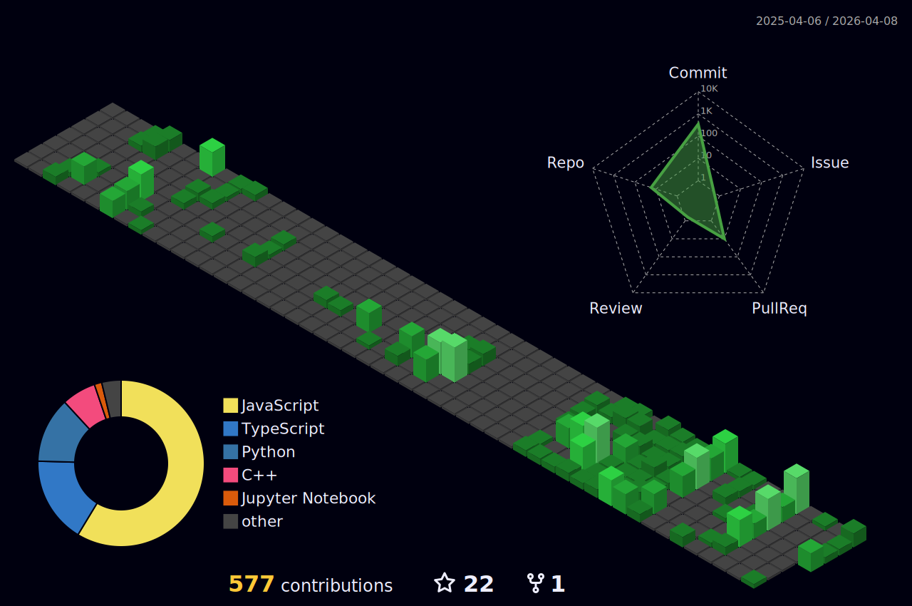

<div align="center">

  

</div>

<div align="center">
  <a href="https://git.io/typing-svg">
    
  </a>
</div>

<div align="center">
  
</div>

<div align="center">
  
</div>

<br />

<div align="center">
  <em>Final Year CS Student @ <strong>UTS</strong> | Building GradStack @ <strong>Graduated.io</strong></em>
</div>

<br />

### 🏆 Featured Projects

*   **[South Asia Earthquake Severity](https://github.com/AmanSinghNp/South-Asia-Earthquake-Severity)**: Spatiotemporal deep learning pipeline predicting earthquake damage.
*   **[ASL Interpreter AI](https://github.com/AmanSinghNp/ASL-Interpreter-AI)**: Real-time sign language recognition using MediaPipe and OpenCV.
*   **[Mini JavaScript Projects](https://github.com/AmanSinghNp/Mini-JavaScript-Projects)**: Custom physics engines, financial calculators, and visualizers built from scratch.

---

### 🧠 Engineering & Research Focus
*Leveraging deep learning and algorithmic first-principles to solve complex problems.*

#### 📉 Seismic Intelligence (ML)
**[South Asia & Nepal Earthquake Severity](https://github.com/AmanSinghNp/South-Asia-Earthquake-Severity)**
Designed a deep learning pipeline to predict earthquake damage severity using spatiotemporal analysis.
*   **Tech**: `PyTorch` `Geospatial Analysis` `Pandas`
*   **Focus**: Modeling complex tectonic patterns and regional risk factors.

#### 👁️ Computer Vision Systems
**[ASL Interpreter AI](https://github.com/AmanSinghNp/ASL-Interpreter-AI)**
Built a real-time American Sign Language recognition system using landmark detection.
*   **Tech**: `OpenCV` `MediaPipe` `Python`
*   **Focus**: High-performance gesture tracking and interactive systems.

---

### ⚛️ The Engineering Sandbox
*[View Repository: Mini-JavaScript-Projects](https://github.com/AmanSinghNp/Mini-JavaScript-Projects)*

> **"What I cannot create, I do not understand."** — *Richard Feynman*
>
> This repository contains **engine-level implementations** built from scratch to demonstrate core computer science concepts. No external physics or game libraries used.

#### 🕹️ Physics & Engines
*   **Ray Casting Engine**: Implemented pseudo-3D rendering logic and wall-slice scaling (Wolfenstein 3D style) from scratch.
*   **Rigid Body Collision**: Custom physics loop handling momentum conservation, elastic collisions, and spatial partitioning.
*   **Game Loop Architecture**: High-performance requestAnimationFrame loops handling delta-time, state updates, and rendering.

#### 📊 Applied Math & Visuals
*   **Black-Scholes Calculator**: Interactive visualization of Option Greeks (Delta, Gamma, Vega) and real-time heatmaps.
*   **Audio Intelligence**: Real-time frequency analysis (FFT) and audio-reactive particle systems.
*   **Geometry Engines**: Vector mathematics and coordinate system transformations for generative art.

---

### 🛠️ Languages & Tools
<div align="center">
  
</div>

<br/>

### 📟 Workflow & Environment
```yaml
# I prioritize velocity and system architecture.
Role: "Final Year Student @ UTS"
Work: "Building GradStack @ Graduated.io"
Research: "Seismic Spatiotemporal Analysis"
Environment: "Antigravity + Claude Code (Agentic Workflow)"
Philosophy: "Ship fast, understand the primitives."
```

